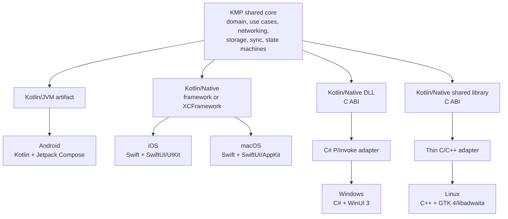
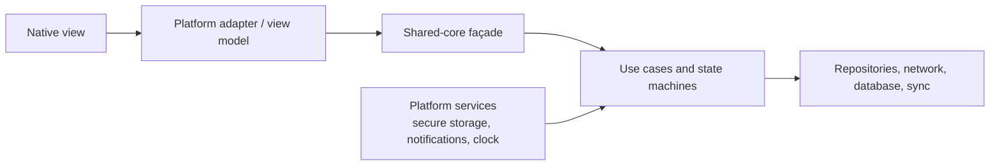
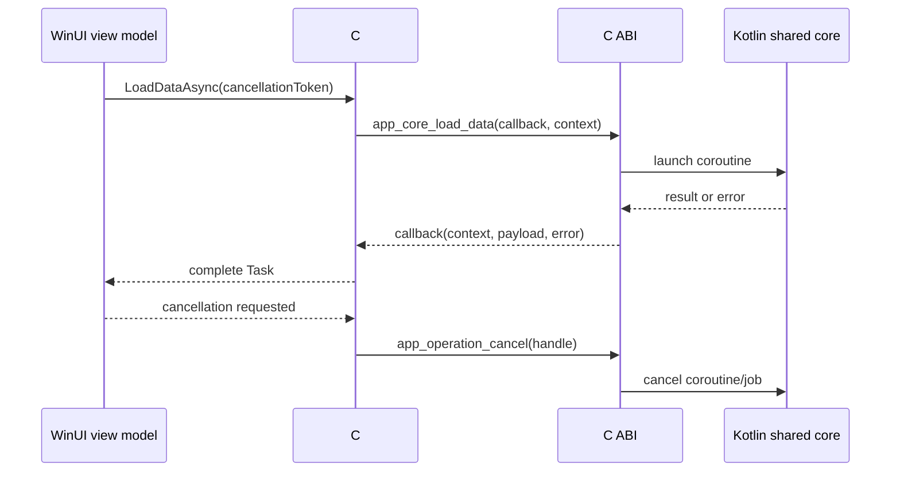

# App Stacks Plan

## Decision summary

Use **Kotlin Multiplatform (KMP)** for shared source organization and **Kotlin/Native** for native targets. Build every user interface with that platform's first-party native UI stack.

| Platform | Platform language | Native UI | Shared-core integration |
|---|---|---|---|
| Android | Kotlin | Jetpack Compose | Direct Kotlin/JVM dependency |
| iOS | Swift | SwiftUI, with UIKit where needed | Kotlin/Native Apple framework or XCFramework |
| macOS | Swift | SwiftUI, with AppKit where needed | Kotlin/Native Apple framework or XCFramework |
| Windows | C# | WinUI 3 | Kotlin/Native DLL through a C ABI and a C# P/Invoke adapter |
| Linux | C++ | GTK 4 and libadwaita | Kotlin/Native shared library through a C ABI and a thin C/C++ adapter |


Note: 
- if we are going with C# for windows we should use https://github.com/gircore/gir.core as gtk/adw binding for C# for linux
- if we are going with Kotlin for windows and linux we should use https://github.com/nttr-tech/winui4k and https://github.com/jwharm/java-gi 

Side Note:
- https://github.com/compose4gtk/compose-4-gtk is based on https://github.com/jwharm/java-gi to use compose runtime to create adw apps
- there are no similar thing for winui3
- so this option is out of the table atm

The governing rule is:

> Share product logic and infrastructure; keep UI, platform behavior, and platform integrations native.


## Target architecture



### Source-set shape

```text
shared/
├── commonMain/          Product logic and portable infrastructure
├── commonTest/          Shared behavior and contract tests
├── androidMain/         Android implementations and adapters
├── appleMain/           Code shared by iOS and macOS targets
├── iosMain/             iOS-only implementations
├── macosMain/           macOS-only implementations
├── mingwMain/           Windows implementations and C-export façade
└── linuxMain/           Linux implementations and C-export façade

apps/
├── android/             Kotlin + Jetpack Compose
├── ios/                 Swift + SwiftUI/UIKit
├── macos/               Swift + SwiftUI/AppKit
├── windows/             C# + WinUI 3 + generated/handwritten adapter
└── linux/               C++ + GTK 4/libadwaita + thin adapter
```

Exact source-set names should follow the selected Kotlin targets and may differ slightly from this conceptual layout.

## Responsibility boundaries

### Shared KMP core

The shared core should own behavior that must be consistent across products:

- Domain entities, value objects, validation, and business rules
- Application use cases and orchestration
- Networking protocols, request construction, serialization, and API clients
- Database abstractions, repositories, caching, offline behavior, and synchronization
- Authentication and session state, excluding platform credential presentation
- State machines and presentation-neutral screen state
- Retry, timeout, conflict-resolution, and error-classification policies
- Analytics event definitions, feature-flag evaluation, and logging abstractions
- Cross-platform tests, fixtures, and contract tests
- Narrow interfaces for services supplied by each platform

The core may expose observable state and commands, but it should not expose UI controls, platform view models, navigation objects, colors, typography, or layout concepts.

### Platform applications

Each native application should own:

- UI composition, layout, theming, animation, accessibility, and input behavior
- Navigation, windows, scenes, lifecycle, and background-execution integration
- Platform conventions, adaptive layouts, menus, keyboard shortcuts, and system surfaces
- Permissions and OS-specific privacy flows
- Notifications, widgets, share targets, app intents, deep links, and other shell integrations
- Secure storage and platform authentication APIs
- Store, billing, updater, installer, packaging, signing, and distribution concerns
- Platform-native telemetry SDK wiring
- Conversion between core-facing models and view-specific state where that improves the native API

### Boundary rule

Prefer a small, use-case-oriented public API over exporting the internal object graph. For example, expose `signIn`, `observeInbox`, and `cancelOperation`, not networking clients, database handles, coroutine scopes, or persistence entities.



## Platform integration details

### Android

- Compile shared code for the JVM/Android target and consume it as a normal Gradle dependency.
- Call the shared API directly from Kotlin.
- Adapt shared `Flow` state into lifecycle-aware Compose state in the Android layer.
- Keep Android lifecycle, permissions, navigation, and Jetpack integrations outside the shared core.

This is the lowest-friction integration and the baseline against which the other targets should be compared.

### iOS and macOS

- Build the shared Kotlin/Native module as an Apple framework for a single target or as an XCFramework when one distributable must contain multiple device and simulator architectures.
- Link the binary from Xcode and import its exported API into Swift.
- Put a small Swift façade around generated names and interop shapes when doing so improves Swift ergonomics.
- Package resources separately; do not assume Kotlin/Native's binary alone handles app resources or platform configuration.
- Keep SwiftUI, UIKit, AppKit, app lifecycle, system integrations, and native navigation in the Apple projects.

The exported surface should stay intentionally narrow. Kotlin features that do not map cleanly to the generated Apple API should be hidden behind bridge-friendly façades. Direct Swift export may be evaluated when it is sufficiently stable for the project's toolchain, but the plan does not depend on it; the framework/XCFramework route is the baseline.

### Windows and Linux through a C ABI

Kotlin/Native can produce native dynamic libraries for these targets and an accompanying C header for exported declarations. Treat that header as the portability boundary rather than exposing arbitrary Kotlin classes directly.

The C-facing API should use a deliberately small set of stable shapes:

- Opaque handles for stateful Kotlin objects
- Explicit create, retain/own, and dispose operations
- Fixed-width numeric types
- UTF-8 strings with a documented ownership rule
- Pointer-and-length pairs for binary data
- Plain enums or integer status codes
- Callback function pointers plus an opaque caller context
- Explicit cancellation handles
- Structured error accessors rather than exceptions crossing the ABI

Conceptually:

```c
typedef void* app_core_handle;
typedef void* app_operation_handle;

typedef struct {
    int32_t code;
    const char* message_utf8;
} app_error;

typedef void (*app_bytes_callback)(
    void* context,
    const uint8_t* data,
    size_t length,
    const app_error* error
);

app_core_handle app_core_create(const app_config* config);
void app_core_dispose(app_core_handle core);

app_operation_handle app_core_load_data(
    app_core_handle core,
    void* context,
    app_bytes_callback callback
);

void app_operation_cancel(app_operation_handle operation);
void app_operation_dispose(app_operation_handle operation);
```

This is an illustrative contract, not a claim about the exact symbols generated by Kotlin/Native. The proof of concept must determine which exports are generated automatically, which need a Kotlin bridge façade, and whether a small C shim is useful for producing a cleaner, versioned ABI.

#### Linux adapter

C++ can consume the generated C header directly. Add a thin RAII wrapper to:

- Dispose opaque handles deterministically
- Translate status/error values to an application result type
- Convert callbacks into the asynchronous mechanism selected by the GTK application
- Marshal data into C++ containers without extending the lifetime of borrowed memory
- Dispatch model updates to the GTK main loop before touching UI state

The adapter should remain thin and mechanical; product behavior belongs in the Kotlin core or the native UI layer.

#### Windows adapter and the remaining C# challenge

.NET can call the Kotlin/Native DLL through P/Invoke, but Kotlin/Native does not provide a complete, idiomatic C# binding equivalent to Android's direct dependency or Apple's framework consumption. The project therefore needs a C# adapter—and potentially a small binding generator—that reads or mirrors the C contract and provides:

- Safe handles around native pointers
- `Task`-based asynchronous methods
- `IAsyncEnumerable<T>` or `IObservable<T>` streams
- Delegates pinned for the full native callback lifetime
- Cancellation-token propagation
- Managed exceptions or result types built from native errors
- Deterministic disposal and protection from use-after-free
- Managed copies or carefully scoped views of native strings and buffers

The adapter should hide all P/Invoke declarations from the WinUI application. WinUI code should consume an ordinary, idiomatic C# interface.



## Interop design principles

1. **No exception may cross the C boundary.** Convert failures to explicit error records or status codes at the Kotlin edge.
2. **Every allocation needs one documented owner.** State whether memory is borrowed for a callback, transferred to the caller, or released by a named function.
3. **Every long-lived native object needs an explicit release path.** Managed finalizers may be a safety net, but not the primary lifecycle mechanism.
4. **Callbacks are asynchronous unless explicitly documented otherwise.** Hosts must not assume the callback runs on the caller's thread.
5. **UI dispatch belongs to the host.** The shared core should not know about the WinUI dispatcher or GLib main context.
6. **Cancellation is part of the ABI.** Do not simulate it by merely ignoring a completed result.
7. **Version the façade.** Keep exported names and layouts stable, add capability/version queries, and evolve the contract compatibly where possible.
8. **Copy first, optimize after measurement.** Initial bridges should copy strings, collections, and binary payloads unless a clearly bounded zero-copy lifetime can be proven.

## Proof-of-concept checklist

The architectural decision is provisional until one vertical slice works on all five platforms, with special emphasis on Windows. The slice should include a network or database operation, a live state stream, cancellation, and a native UI that displays the result.

### Build and packaging

- [ ] Build the shared core for Android and consume it directly from the Android app.
- [ ] Produce Apple device and simulator binaries and package an XCFramework.
- [ ] Import the XCFramework into minimal iOS and macOS apps.
- [ ] Produce a Windows DLL and inspect/compile against its generated C header.
- [ ] Produce a Linux shared library and inspect/compile against its generated C header.
- [ ] Verify debug and release builds, symbols, architecture selection, runtime dependencies, and packaging.
- [ ] Define ABI-version and core-version queries.

### `suspend` to C# `Task`

- [ ] Expose a representative suspending Kotlin operation through a completion callback.
- [ ] Wrap the callback with `TaskCompletionSource<T>` using asynchronous continuation behavior.
- [ ] Prove exactly-once completion for success, failure, and cancellation.
- [ ] Handle synchronous failure during operation startup.
- [ ] Verify callback delegate and caller-context lifetimes until completion.
- [ ] Confirm that completion on a native worker thread does not accidentally update WinUI directly.

### `Flow` to `IAsyncEnumerable` or `IObservable`

- [ ] Prototype both `IAsyncEnumerable<T>` and `IObservable<T>` host shapes.
- [ ] Select one default based on state replay, multiple subscribers, backpressure, and app usage.
- [ ] Return a subscription handle for every native collection job.
- [ ] Stop collection when enumeration/subscription ends or is disposed.
- [ ] Define ordering, buffering, replay, conflation, and slow-consumer behavior.
- [ ] Propagate terminal errors and normal completion distinctly.
- [ ] Verify repeated subscribe/unsubscribe cycles do not leak Kotlin jobs, callbacks, or handles.

### Errors

- [ ] Define stable error domains/codes independent of Kotlin exception class names.
- [ ] Preserve a safe human-readable message and optional diagnostic metadata.
- [ ] Map native cancellation separately from operational failure.
- [ ] Decide which errors become C# exceptions and which remain typed result values.
- [ ] Ensure no Kotlin/Native exception crosses the C ABI.

### Callbacks and reverse calls

- [ ] Pass an opaque context pointer through every callback.
- [ ] Keep C# delegates rooted/pinned for as long as native code can invoke them.
- [ ] Define whether callbacks may be concurrent or reentrant.
- [ ] Define an unsubscribe/dispose handshake that prevents callbacks after release.
- [ ] Test a platform service implemented in C#/C++ and called from Kotlin.
- [ ] Prevent exceptions thrown by C# or C++ callbacks from crossing into Kotlin/native frames.

### Object lifetime and garbage collection

- [ ] Model native objects as opaque handles with explicit disposal.
- [ ] Wrap Windows handles with `SafeHandle` or an equivalent deterministic owner.
- [ ] Wrap Linux handles with RAII.
- [ ] Document borrowed, shared, and transferred ownership for every pointer.
- [ ] Test host GC while native operations and callbacks are active.
- [ ] Test double-dispose, cancellation-plus-dispose, late callback, and use-after-dispose scenarios.
- [ ] Run sustained create/use/dispose loops and check managed and native memory growth.

### Threading

- [ ] Record which threads may enter each exported function.
- [ ] Verify Kotlin callbacks from background workers into C# and C++.
- [ ] Marshal UI-facing updates to the WinUI dispatcher and GLib main context.
- [ ] Test concurrent calls against the same core handle.
- [ ] Define synchronization and reentrancy guarantees in the public contract.
- [ ] Confirm chosen Kotlin/Native libraries and dispatchers behave on Windows and Linux targets.

### Cancellation

- [ ] Return a cancellable operation handle when starting asynchronous work.
- [ ] Connect C# `CancellationToken` to Kotlin coroutine cancellation.
- [ ] Connect Linux host cancellation to the same core mechanism.
- [ ] Make cancellation idempotent and race-safe with completion and disposal.
- [ ] Confirm underlying network/database work is cancelled where supported, not merely detached.
- [ ] Define the observable result when cancellation races with success.

### Collections

- [ ] Test lists, maps, nested models, empty collections, and large collections.
- [ ] Compare item-by-item C calls with serialized or packed transfer.
- [ ] Choose a representation that is simple before attempting zero-copy access.
- [ ] Document ordering, duplicate-key behavior, and mutability.
- [ ] Benchmark conversion cost on realistic payloads.

### Nullable types

- [ ] Define nullable scalar representations without ambiguous sentinel values.
- [ ] Distinguish absent string/buffer from present-but-empty.
- [ ] Test nullable fields inside collections and nested models.
- [ ] Generate or handwrite C# nullable-reference and nullable-value annotations correctly.
- [ ] Verify Swift, C#, and C++ observe the same domain semantics.

### Binary data

- [ ] Represent buffers as pointer plus explicit byte length.
- [ ] Specify whether buffer memory is borrowed, copied, or transferred.
- [ ] Test zero-length buffers and payloads containing zero bytes.
- [ ] Copy callback-scoped buffers before the callback returns unless ownership is transferred.
- [ ] Provide an explicit release function for transferred native buffers.
- [ ] Benchmark representative small and large payloads before considering zero-copy optimization.

### Acceptance criteria

- [ ] The same shared use case passes common contract tests and runs from all five native apps.
- [ ] Each app uses its designated native UI toolkit; no shared UI runtime is required.
- [ ] Windows exposes an idiomatic C# API with no P/Invoke details in WinUI code.
- [ ] Linux exposes an idiomatic, ownership-safe C++ wrapper with no raw ABI calls in GTK views.
- [ ] Cancellation, errors, streams, and disposal behave consistently under race and stress tests.
- [ ] Automated checks detect ABI drift between Kotlin exports and the C#/C++ adapters.
- [ ] Packaging succeeds for the intended CPU architectures and distribution formats.

## Recommended proof-of-concept slice

Implement a small “items” feature rather than isolated interop demonstrations:

1. Load a cached list from the shared repository.
2. Refresh it with a suspending network call.
3. Expose live state as a `Flow`.
4. Allow refresh cancellation.
5. Include one typed domain failure and one unexpected failure.
6. Include nullable text, a collection, and a binary thumbnail.
7. Render the state in Compose, SwiftUI, WinUI 3, and GTK 4/libadwaita.
8. Repeatedly open and close the screen to exercise subscription and object cleanup.

This slice crosses every risky boundary while remaining small enough to discard or redesign if the Windows bridge is not viable.

## Delivery sequence

1. Define the shared-domain façade and the interop ownership/error conventions.
2. Implement the feature in `commonMain` and prove the direct Android path.
3. Prove the Apple XCFramework path on iOS and macOS.
4. Freeze a minimal C ABI for the same feature.
5. Build the Linux C++ wrapper and GTK screen.
6. Build the C# P/Invoke adapter and WinUI screen.
7. Stress-test cancellation, threading, callbacks, and disposal.
8. Decide whether to handwrite the small bridge, generate it from a schema/header, or introduce a dedicated binding tool.
9. Only then expand the shared-core API and establish release automation.

## Risks and decision gates

| Risk | Why it matters | Decision gate or mitigation |
|---|---|---|
| Kotlin/Native-to-C# ergonomics | The generated C surface is not an idiomatic .NET API | Require the Windows proof of concept before committing the full architecture |
| Async and stream impedance | Coroutines and `Flow` do not cross a C ABI directly | Standardize callback, subscription, cancellation, and disposal contracts |
| Memory ownership | Three memory-management models meet at the native boundary | Opaque handles, explicit release APIs, stress tests, and safe wrappers |
| Thread affinity | Native UIs require updates on their own UI threads | Keep dispatch in platform adapters and document callback threading |
| ABI evolution | Kotlin API changes can break C#/C++ consumers | Export a narrow façade, version it, and check generated headers in CI |
| Library target support | A common Kotlin dependency may not support every native target equally | Validate Windows and Linux support before adopting shared dependencies |
| Platform divergence | Over-sharing can force lowest-common-denominator behavior | Share policies and domain state, not UI or OS-specific workflows |
| Build/distribution complexity | Five apps still require five native toolchains | Treat each native app as a first-class deliverable with its own CI lane |

## Final conclusion

For Android, iOS, macOS, Windows, and Linux with genuinely native UI, the best starting architecture is:

- **Kotlin Multiplatform/Kotlin Native for the shared core**
- **Jetpack Compose/Kotlin on Android**
- **SwiftUI with UIKit/AppKit fallbacks in Swift on Apple platforms**
- **WinUI 3/C# on Windows**
- **GTK 4/libadwaita/C++ on Linux**

KMP is preferred over Rust here because it makes Android integration direct, gives Apple platforms a native framework packaging path, and confines custom C binding work to Windows and Linux. The remaining uncertainty is not the overall sharing model; it is whether the Kotlin/Native C ABI can be wrapped into a reliable, maintainable, idiomatic C# layer at acceptable cost.

The next action is therefore a narrow end-to-end proof of concept, with the Windows adapter treated as the decisive architecture gate.

---

## Appendix: verified library matrix (Aug 2026)

Verified by building `Tilawa/shared` (`:shared:assemble` green on all 5 targets; Kotlin 2.3.21, AGP 9.2.0):

| Concern | Library | Status |
|---|---|---|
| Async/streams | kotlinx-coroutines 1.10.2 | ✅ all 5 targets |
| Serialization | kotlinx-serialization-json 1.11.0 | ✅ all 5 targets |
| Date/time | kotlinx-datetime 0.7.1 | ✅ all 5 targets |
| HTTP | Ktor 3.1.3 — okhttp (android), darwin (apple), curl (mingw/linux) | ✅ all 5 targets |
| Key-value | multiplatform-settings 1.3.0 | ✅ all 5 targets |
| Logging | Kermit 2.0.5 | ✅ all 5 targets |
| Database | **open gate** — SQLDelight 2.3.2 fails: its runtime pulls `co.touchlab:sqliter-driver` (`-lsqlite3`) into every native link; SQLiter has no linuxX64 variant and mingwX64 cross-link from macOS fails (no system sqlite3). Likely resolution: Room KMP with bundled sqlite. Decide in the PoC slice | ❌ removed |

Also verified: SQLDelight ≤ 2.1.0 breaks AGP 9 KMP modules (drags AGP 8 onto the buildscript classpath) — 2.3.2 fixes that but not the link issue.

Initial C ABI snapshots committed to `abi/mingwX64/Shared_api.h` and `abi/linuxX64/libShared_api.h`; `scripts/abi-check.sh` is the drift gate.

Tooling created: skills in `/skills/` (kmp-core, kmp-c-abi, kmp-apple-bridge, kmp-windows-bridge, kmp-linux-bridge), `/abi-check` command, and `/scripts`.
