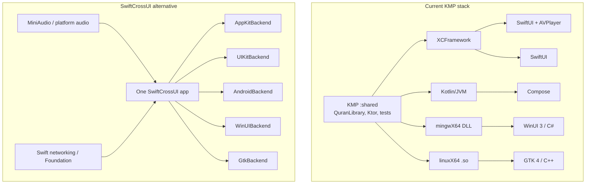

# KMP (XCFramework + kotlin-native-nuget) vs SwiftCrossUI

Research date: 19 August 2026.
This document compares two ways to ship Tilawa across Android, iOS, macOS, Windows, and Linux. It does **not** change `.ai/arch/APP_STACKS_PLAN.md`, `.ai/plans/MACOS_POC_PLAN.md`, or `.junie/plans/quran-data-sourcing-and-playback.md`.

**Sources checked live for this write-up**

- Tilawa as built: `.ai/arch/APP_STACKS_PLAN.md`, `:shared`, `macosApp`, `windowsApp/Shared.cs`, `linuxApp`, `androidApp`, `iosApp`
- [moreSwift/swift-cross-ui](https://github.com/moreSwift/swift-cross-ui) (`v0.9.0`, released 19 Aug 2026)
- [xxfast/kotlin-native-nuget](https://github.com/xxfast/kotlin-native-nuget) (`0.3.0`, released 10 Aug 2026) and [its docs](https://xxfast.github.io/kotlin-native-nuget/)
- Swift Android Workgroup / Swift 6.3 Android SDK reporting (March–May 2026)

---

## Decision summary

Keep Tilawa on **Kotlin Multiplatform for shared logic + first-party native UI per shell**. Treat **XCFramework** as the Apple consumption path (already shipping on macOS). Treat **kotlin-native-nuget** as a possible later upgrade for the Windows C# adapter only — not as a reason to change the architecture. **Do not adopt SwiftCrossUI as Tilawa's UI or shared-core stack.**

The two options share a surface-level slogan ("one language, five platforms") but they share **different things**:

| | KMP + native shells (current, optionally + NuGet) | SwiftCrossUI |
|---|---|---|
| What is shared | Product logic (`:shared`) | UI tree + most app code in Swift |
| What stays native | UI, playback, OS chrome | Widget toolkit *behind* a SwiftUI-like façade |
| Tilawa fit | Matches the already-built data layer, macOS player, and architecture plan | Would rewrite the working macOS app and throw away or dual-maintain `:shared` |
| Maturity for this product | KMP/XCFramework proven here; NuGet plugin is experimental | Framework is 0.x, 213 open issues, explicitly "work in progress" |

The remaining Windows uncertainty in `APP_STACKS_PLAN.md` ("can we wrap the Kotlin/Native C ABI into idiomatic C#?") is exactly what kotlin-native-nuget tries to automate. That is an adapter-quality question, not a reason to switch UI frameworks.



---

## What "the stack we talked about" actually is

Two packaging bridges around one shared Kotlin core — not a shared UI runtime.

### Apple: XCFramework (already in Tilawa)

`shared/build.gradle.kts` builds a static `Shared` XCFramework. `macosApp/Package.swift` consumes it as a SwiftPM `binaryTarget`:

```text
shared/build/XCFrameworks/release/Shared.xcframework
```

iOS is documented the same way (`iosApp/README.md`). Swift imports `Shared` and calls the narrow `QuranLibrary` façade (`reciters()`, `editions()`, `chapters()`, `verses()`, `surah()`, download helpers). UI, navigation, and `AVPlayer` stay in Swift (`VersePlayer`, `PlayerViewModel`, `ReciterGridView`, `ReciterDetailView`).

This is the official Kotlin/Native Apple path. SKIE / Swift Export are optional ergonomics later; the plan does not depend on them.

### Windows: handwritten C ABI today, kotlin-native-nuget as the upgrade

Today `windowsApp` does **not** use NuGet. It P/Invokes three C symbols from `Shared.dll`:

- `shared_abi_version`
- `shared_greet`
- `shared_string_free`

That is the `kmp-c-abi` + `kmp-windows-bridge` contract: opaque C, JSON payloads, handwritten `Shared.cs`. The Quran domain is **not** exported on this ABI yet.

[kotlin-native-nuget](https://github.com/xxfast/kotlin-native-nuget) (Isuru Rajapakse / xxfast) is a Gradle plugin that would replace that handwritten layer:

1. KSP walks public Kotlin/Native declarations.
2. It emits a stable C ABI (`Bridges.kt` / `@CName` shims) plus generated `Interop.cs`.
3. It packs native libs into a `.nupkg` as `runtimes/{rid}/native/` plus `contentFiles/cs/any/Interop.cs`.
4. A C# / WinUI project references the NuGet package and sees idiomatic C# (`IDisposable` wrappers, `Task` for `suspend`, planned `IAsyncEnumerable<T>` for `Flow`).

It is **bidirectional** (C# → Kotlin bindings exist too) and **experimental**: `0.x`, official Kotlin "Experimental" badge, 14 GitHub stars, 0 forks, latest release `0.3.0` (10 Aug 2026).

Documented target / RID map (CI column from the plugin's own prerequisites page):

| Kotlin target | NuGet RID | Exercised in plugin CI |
|---|---|---|
| `mingwX64` | `win-x64` | Yes |
| `macosArm64` | `osx-arm64` | Yes |
| `macosX64` | `osx-x64` | No |
| `linuxX64` | `linux-x64` | No |
| `linuxArm64` | `linux-arm64` | No |

Compatibility table for `0.2.0`–`0.3.0`: **Kotlin 2.4.10**, KSP 2.3.10, Gradle 9.1, JDK 17+, .NET 8+. Tilawa is on **Kotlin 2.3.21**. Adopting the plugin is a Kotlin bump, not a drop-in.

What it does **not** replace:

- Linux C++ / GTK (NuGet is a .NET package; `linuxApp` is CMake + gtkmm)
- Apple Swift (XCFramework remains the right Apple artifact; a macOS NuGet RID is for .NET-on-Mac, not SwiftUI)
- Android (already a direct Kotlin/JVM dependency)

### Linux and Android stay as they are

- Android: `:androidApp` depends on `:shared` as Kotlin. Lowest-friction path in the whole architecture.
- Linux: `libShared.so` + C header + C++ RAII adapter. kotlin-native-nuget does not generate C++.

---

## What SwiftCrossUI actually is

[SwiftCrossUI](https://github.com/moreSwift/swift-cross-ui) is a **SwiftUI-like declarative UI framework** (Swift 5.10+) with pluggable native backends. It is **not** Apple SwiftUI, and its own README says it will not track SwiftUI's API perfectly.

Verified 19 Aug 2026:

- **1,716 stars**, 87 forks, **213 open issues**, MIT, first commit Jan 2022
- Latest tag **`v0.9.0`** (same day as this research)
- Docs site still labels the project a work in progress
- Requires [Swift Bundler](https://github.com/moreSwift/swift-bundler) for iOS / tvOS / Android device and emulator runs; plain `swift run` is documented as non-recommended (broken resources, no deep links, no iOS/tvOS)

### Backends (`DefaultBackend` mapping)

| Host OS | Backend | Native toolkit | Claimed coverage |
|---|---|---|---|
| macOS | `AppKitBackend` | AppKit | "all" SwiftCrossUI features |
| iOS / tvOS | `UIKitBackend` | UIKit | "most" |
| Android | `AndroidBackend` | Android Views / JNI (`AndroidKit`) | "most" |
| Windows | `WinUIBackend` | WinUI 3 via `swift-winui` | "most" |
| Linux | `GtkBackend` | GTK 4 | "most" |
| Older Linux | `Gtk3Backend` | GTK 3 | "most"; "quite buggy on macOS" |

Commented / unfinished backends in the tree: Curses, Qt, LVGL. There is no first-party SwiftUI backend — even on Apple, you are **not** writing SwiftUI.

`DefaultBackend` picks the row above. `SCUI_DEFAULT_BACKEND` can override at compile time (e.g. run the Gtk backend on a Mac).

### Built-in views (framework, not a full SwiftUI)

Present in `Sources/SwiftCrossUI/Views`: `Button`, `Text`, `TextField`, `SecureField`, `TextEditor`, `Toggle` / `Checkbox` / `ToggleSwitch`, `Slider`, `Picker`, `ProgressView`, `Image`, `List`, `Table`, `ScrollView`, `HStack` / `VStack` / `ZStack`, `NavigationStack` / `NavigationSplitView` / `NavigationLink`, `SplitView`, `Menu`, `WebView`, `DatePicker`, `GeometryReader`, shapes, gradients.

Open feature issues that matter for a real product: animation system (#721), blur (#720), custom button styles (#719), ComboBox (#688), Xcode Previews (#689 / #687), dummy stubs for remaining SwiftUI APIs (#717). Layout bugs are still landing on AppKit, Gtk, and Table.

There is **no** `layoutDirection` / RTL environment in the source tree (locale helpers exist for calendars on Android/Windows only). Arabic *text* can render if the backend's `Text` uses a native control that understands Unicode; **mirroring, bidi chrome, and Quran-quality typography are not a designed feature**.

### Android is real, and also young

`AndroidBackend` is a first-class product now (entrypoint `AndroidBackend_entrypoint`, JNI, custom Android widgets, lists, text fields, sliders, sheets, web views). A Dec 2025 / Jan 2026 project update still described Android as "text and buttons" while Swift Bundler learned to emit APKs. Eight months later the backend file list is large, but:

- GitHub topics still omit `android`
- Swift's own Android Workgroup is explicit that **cross-platform UI is not on the official Swift-for-Android roadmap**
- Swift 6.3 (24 Mar 2026) shipped the first official Swift SDK for Android for *logic* compilation, not UI
- Community UI options are SwiftCrossUI (native-backend) or Skip (transpile SwiftUI → Compose)

### Audio is not a framework feature

The official `MusicPlayerExample` does **not** use AVPlayer, Media3, or WinRT media. It depends on **MiniAudio** (`swift-miniaudio`) and a custom `MediaPlayer` (`start` / `stop` / `seek(toSecond:)` / cursor polling at 30 Hz). Playback UI is a `ProgressView`, not a platform now-playing integration.

That is the honest SwiftCrossUI audio story: you bring your own engine, or you drop out of the abstraction per backend (`AVPlayer` on Apple, ExoPlayer/Media3 on Android, etc.) and immediately lose "write once".

---

## Tilawa as it exists today (the switching cost)

This comparison is not greenfield.

**Already shared in Kotlin (`:shared`)**

- `Mp3QuranApi` (reciters, riwayat, timed reads, ayah timing)
- `LocalQuranTextSource` (114 chapters, 6,236 Uthmani verses, zero network)
- Domain: `Reciter`, `Riwayah`, `RecitationEdition`, `Verse`, `VerseTiming`, `PlaybackTrack`
- `GetRecitationEditions` / `GetSurah` / download store
- `commonTest` with Ktor `MockEngine` (the project's testing rule)

**Already native on macOS**

- Reciter grid → riwayah/style detail → player
- `VersePlayer` (`AVPlayer`) with `seek(to:)`
- Timing-driven verse highlight **or** no highlight + plain seek bar
- Per-surah download affordances
- Liquid Glass via a single `Glass.swift` seam (`#available(macOS 26, *)`)

**Still stubs**

- Android / iOS: template shells
- Windows / Linux: `shared_greet()` only

`APP_STACKS_PLAN.md`'s governing rule is still the contract:

> Share product logic and infrastructure; keep UI, platform behavior, and platform integrations native.

kmp-core also forbids Compose Multiplatform and shared UI. SwiftCrossUI is the same *kind* of violation, just from the Swift side.

---

## Side-by-side, by concern

### 1. Sharing model

| | KMP + XCFramework + (optional) NuGet | SwiftCrossUI |
|---|---|---|
| Shared artifact | Kotlin source + per-target binaries | Swift source compiled per OS |
| Shared UI | Forbidden by architecture | The whole point |
| Native look | First-party toolkits, first-party idioms | Native *controls* behind a lowest-common-denominator API |
| New OS feature (Liquid Glass, Material expressive, WinUI teaching tip) | Available the day the platform ships it | Available only after SwiftCrossUI grows a backend hook |

KMP's cost is writing the reciter grid / player **five times**, refined from the macOS original (already the agreed roadmap). SwiftCrossUI's cost is living inside someone else's SwiftUI subset on every platform, including Apple.

### 2. Platform coverage vs Tilawa's five shells

| Shell | KMP path today | If we adopt kotlin-native-nuget | If we adopt SwiftCrossUI |
|---|---|---|---|
| Android | Direct Kotlin + Compose | Unchanged (best path) | Rewrite UI in SwiftCrossUI; Swift Android SDK + JNI backend |
| iOS | XCFramework + SwiftUI | Unchanged | Leave SwiftUI; take UIKitBackend |
| macOS | XCFramework + SwiftUI + AVPlayer (working) | Unchanged | Rewrite working player into AppKitBackend; lose SwiftUI/Liquid Glass |
| Windows | Handwritten C ABI + WinUI 3 / C# | Generated C# API from `QuranLibrary`; still WinUI 3 | WinUIBackend in Swift; C# shell deleted |
| Linux | C ABI + GTK 4 / C++ | Unchanged (plugin does not emit C++) | GtkBackend in Swift; C++ shell deleted |

SwiftCrossUI covers the same five OS names. It does **not** preserve Tilawa's five *implementation* choices (Compose, SwiftUI, WinUI/C#, GTK/C++).

### 3. Data layer and networking

| | KMP | SwiftCrossUI |
|---|---|---|
| HTTP | Ktor, already green on all 5 targets (okhttp / darwin / curl) | Foundation `URLSession` is solid on Apple; Windows/Linux/Android Swift networking is younger and package-dependent |
| JSON | kotlinx.serialization, used end-to-end | `Codable` |
| Offline text | Bundled Kotlin asset + tests | Would re-bundle and re-parse in Swift |
| Existing tests | `commonTest` contract tests | Would be rewritten (Swift Testing / XCTest); no reuse of MockEngine suite |
| Downloads | `DownloadStore` + multiplatform-settings | Reimplement file + prefs per backend or via Foundation |

Switching to SwiftCrossUI means **reimplementing `Mp3QuranApi`, timing, riwayah derivation, and the QUL text loader in Swift**, or keeping Kotlin and calling it from Swift on five backends (Apple XCFramework + JNI on Android + C ABI on desktop). That hybrid is the worst of both worlds: two runtimes, two GCs, two build systems, still no shared UI benefit on Apple (you already have SwiftUI).

### 4. Playback (the product)

Tilawa is a recitation player. Playback cannot be "good enough demo".

| Need | KMP + native UI | SwiftCrossUI |
|---|---|---|
| Gapless one-file-per-surah | Native player per OS (`AVPlayer` done) | MiniAudio demo, or custom per backend |
| Seek to ms | `VersePlayer.seek(to:)` | MiniAudio `seek(toSecond:)`; backend-specific otherwise |
| Verse highlight from timing | View-model vs `VerseTiming` (done on macOS) | Can be written in Swift once — this part *does* port |
| Now Playing / lock screen / headset | Platform APIs in each shell | Not in the framework; per-backend anyway |
| Audio session / background | Platform | Per-backend |
| Offline file:// vs stream | Already in `playbackTrack` | Reimplement |
| Segmented vs plain seek bar | Already designed | Rebuild in SwiftCrossUI controls (`Slider` / `ProgressView` are not `VerseSeekBar`) |

The only playback logic that SwiftCrossUI would actually share is the *timing math*. That math is already in `:shared` / `PlayerViewModel` and is small compared to engine + OS integration.

### 5. Arabic, RTL, mushaf typography

- Native SwiftUI / Compose / WinUI / GTK all have production RTL and complex-script text.
- SwiftCrossUI has no `layoutDirection` API in-tree. `Text` will render glyphs if the native control does, but reciter-grid + mushaf + highlight is a typography-and-layout problem, not a `Text("…")` problem.
- Tilawa already pins `Amiri Quran` on macOS and keeps that choice on the Swift side — correct, because fonts and text shaping are UI.

This is a reason to keep UI native, not to share it.

### 6. Interop quality (the actual KMP pain)

This is the honest weakness of the current stack, and the only place kotlin-native-nuget earns its keep.

| Boundary | Today | With kotlin-native-nuget | With SwiftCrossUI |
|---|---|---|---|
| Kotlin → Swift | Obj-C header; `suspend` ≈ async-without-cancel; `Flow` opaque unless SKIE | Unchanged (still XCFramework) | Gone if Kotlin is deleted |
| Kotlin → C# | Handwritten P/Invoke, 3 symbols | Generated idiomatic C#, `IDisposable`, `Task`; `Flow` → `IAsyncEnumerable` is still an ADR ("Proposed"), `StateFlow`/`SharedFlow` deferred | Gone if the Windows shell becomes Swift |
| Kotlin → C++ | Handwritten RAII | Unchanged | Gone if Linux becomes GtkBackend |
| Identity / GC | Two heaps on Apple and Windows (Kotlin GC + ARC / .NET GC) | Same | One Swift runtime per process (plus JVM on Android backend) |

NuGet plugin caveats that matter if we ever adopt it:

- Experimental; pin the plugin and **diff generated `Interop.cs` on every bump** (their own warning).
- Requires Kotlin **2.4.10**; Tilawa is on **2.3.21**.
- `linuxX64` packaging exists on paper, **not in their CI**.
- Not everything bridges: `Map`/`Set` at some positions, `Sequence`, some extension receivers — skipped with named diagnostics. Tilawa should keep exporting a **narrow façade** (`QuranLibrary`), which is already the rule.
- NativeAOT / `[LibraryImport]` still open on their roadmap.
- 14 stars / single maintainer vs JetBrains-owned KMP.

`APP_STACKS_PLAN.md` already named this as the architecture gate: prove Windows, then decide handwritten vs generated bindings. kotlin-native-nuget is a candidate for step 8 of that delivery sequence, not a new product direction.

### 7. Tooling, CI, team

| | KMP stack | SwiftCrossUI |
|---|---|---|
| IDEs | Android Studio / IntelliJ for `:shared` + Android; Xcode / SwiftPM for Apple; Visual Studio for WinUI; any C++ IDE for Linux | SwiftPM + Swift Bundler everywhere; Xcode Previews **not supported** (open issues) |
| Build graph | Gradle + five native builds (already accepted) | SwiftPM + Bundler + GTK/WinAppSDK/Android NDK as backend deps |
| Debug Kotlin on iOS | Known KMP pain | N/A if no Kotlin |
| Debug Swift on Android | N/A | Young (Swift Android SDK + JNI backend) |
| Hot reload | Compose / SwiftUI / Xcode | Swift Bundler hot reload (`@HotReloadable`) — real, but Bundler-specific |
| Hiring / ecosystem | Kotlin + each platform's native UI (huge) | Swift everywhere, including Android UI via a 0.9 framework (tiny) |
| Store / signing / widgets / intents | Each shell, first-party | Each backend, plus whatever Bundler packages |

### 8. Maturity and risk

| Signal | KMP + XCFramework | kotlin-native-nuget | SwiftCrossUI |
|---|---|---|---|
| Owner | JetBrains | One maintainer (xxfast) | moreSwift community |
| Version | Kotlin 2.3.x production | 0.3.0 experimental | 0.9.0, README says WIP |
| Used in Tilawa | Yes (`:shared`, macOS player) | No | No |
| Stars (Aug 2026) | Language-scale | 14 | 1,716 |
| Open issues | N/A | 1 | 213 |
| SLA / LTS | Commercial + OSS | None | None |
| Can it disappear? | No | Yes | Possible; backends are a lot of surface |

### 9. Migration cost if we switched tomorrow

**To kotlin-native-nuget (Windows only)**

- Bump Kotlin to 2.4.10 and re-verify the 5-target matrix (Ktor, settings, Kermit, curl engines).
- Apply the plugin to `:shared`, scope `include` to `QuranLibrary` + models.
- Replace `windowsApp/Shared.cs` with the generated package.
- Keep C ABI snapshots for Linux; do not delete `kmp-c-abi`.
- Spike: one `reciters()` call from WinUI. If `suspend`/`List<data class>` round-trip is clean, consider exporting `surah()`.

Estimated blast radius: Windows adapter + Gradle. macOS player untouched.

**To SwiftCrossUI (whole app)**

- Rewrite `macosApp` (the only finished UI) off SwiftUI/AVPlayer/Liquid Glass.
- Reimplement `:shared` in Swift **or** keep Kotlin and invent five new bridges.
- Replace Android Compose, iOS SwiftUI, WinUI/C#, GTK/C++ with one SwiftCrossUI app.
- Re-prove audio, RTL, downloads, bundling on five backends.
- Accept 0.9 framework risk as the UI runtime for a Quran player.

Estimated blast radius: the repository. This would be a new product, not a refactor.

---

## Recommendation

### Keep (default)

**KMP shared core + native UI shells**, as written in `.ai/arch/APP_STACKS_PLAN.md`.

- Continue the agreed macOS-first UI, then refine that flow onto Android / iOS / Windows / Linux.
- Keep XCFramework as the Apple bridge.
- Keep the handwritten C ABI for Linux; keep it as the Windows fallback.
- Do not share UI (not Compose Multiplatform, not SwiftCrossUI).

This is the only option that preserves the working player, the tested data layer, and the "native on purpose" rule.

### Evaluate later (optional, Windows-only)

**kotlin-native-nuget** as a generated replacement for `Shared.cs`, after:

1. Kotlin 2.4.x is acceptable for this repo.
2. A spike shows `QuranLibrary.reciters()` / `surah()` as C# `Task` + typed models.
3. Generated `Interop.cs` is pinned and ABI-diffed in CI the same way `abi/` is today.
4. Linux stays on the C header (plugin CI does not prove `linuxX64`).

Until then, extending the existing C façade (`shared_*` + JSON) is the conservative path and matches the skills already in the repo.

### Do not adopt

**SwiftCrossUI as Tilawa's application framework.**

Reasons, in order:

1. It shares the wrong layer. Tilawa's hard problems (catalog, timing, offline text) are already shared in Kotlin. The remaining work is native players and native chrome.
2. It would delete the only finished UI (SwiftUI + AVPlayer + Liquid Glass) in favor of an AppKit backend that is "SwiftUI-like", not SwiftUI.
3. Audio, RTL, and OS integrations fall back to per-backend code anyway — the same N-times cost KMP already accepted, with a weaker abstraction.
4. Android UI-in-Swift is possible (backend exists, official Swift SDK exists) but is not the production Android story; Compose + KMP is.
5. 0.9 + 213 open issues is an unacceptable runtime bet for a recitation app.

SwiftCrossUI is a legitimate project if the goal is "I want to write Swift desktop/mobile UI once and I accept non-SwiftUI Apple UI." That is not Tilawa's goal.

### Rejected hybrid

Keep `:shared` **and** build shells in SwiftCrossUI. You would still maintain Kotlin/Native interop (XCFramework + JNI + C) *and* give up first-party SwiftUI/Compose. No benefit over the current plan.

---

## If a spike is ever justified

Only two spikes are worth the time, and only the first is likely.

### Spike A — kotlin-native-nuget on Windows (recommended if Windows UI work starts)

Done when:

- `:shared` publishes a local `.nupkg` containing `QuranLibrary`
- A throwaway WinUI page lists reciters from `await library.Reciters()` with no hand-written P/Invoke
- Dispose / cancel / exception paths are documented
- `Interop.cs` is committed or hashed in CI

Not done if Kotlin 2.4.10 breaks linux/mingw link or if `List<Reciter>` / `PlaybackTrack` is skipped as unsupported.

### Spike B — SwiftCrossUI music-player only (not recommended)

Clone their `MusicPlayerExample`, point MiniAudio at one mp3quran.net surah, and measure: seek accuracy vs `VerseTiming`, Arabic `Text` in a `List`, Windows and Linux packaging via Swift Bundler. Expect this to confirm MiniAudio ≠ a Quran player and that the macOS rewrite cost is real. Do **not** gate product work on this.

---

## Testing implications (if either spike happens)

Existing `:shared` `commonTest` stays the source of truth for catalog/timing/text. Neither alternative replaces that.

- **NuGet spike:** add a C# smoke test that loads the nupkg and calls `Reciters()` / `Surah(1, featuredEdition)` against MockEngine-equivalent fixtures if feasible; at minimum, a compile+run test on `win-x64`.
- **SwiftCrossUI spike:** do not port `commonTest`; time-box a manual pass of Counter + MusicPlayer examples on macOS and one other backend.

---

## Delivery notes (not a commitment to switch)

No implementation work is implied by this document. If Windows generation is later approved:

1. Kotlin 2.4.10 + matrix assemble
2. Plugin on `:shared`, public surface = `QuranLibrary` only
3. Local nupkg → `windowsApp`
4. Keep `abi/` + C++ path green
5. Only then delete handwritten `NativeMethods` for symbols the generator owns

Nothing in that sequence touches SwiftCrossUI or the macOS player.

---

## Appendix: version pins observed 19 Aug 2026

| Component | Version / state |
|---|---|
| Tilawa Kotlin | 2.3.21 |
| Tilawa Ktor | 3.1.3 (all 5 targets verified in APP_STACKS_PLAN) |
| Tilawa Apple consumption | `Shared.xcframework` binaryTarget |
| Tilawa Windows consumption | Handwritten `Shared.cs` / 3 C symbols |
| kotlin-native-nuget | 0.3.0 (10 Aug 2026), Experimental, Kotlin 2.4.10 |
| SwiftCrossUI | v0.9.0 (19 Aug 2026), Swift 5.10+, 1716★ / 213 issues |
| Swift SDK for Android | Official with Swift 6.3 (24 Mar 2026); UI out of scope for the Workgroup |
