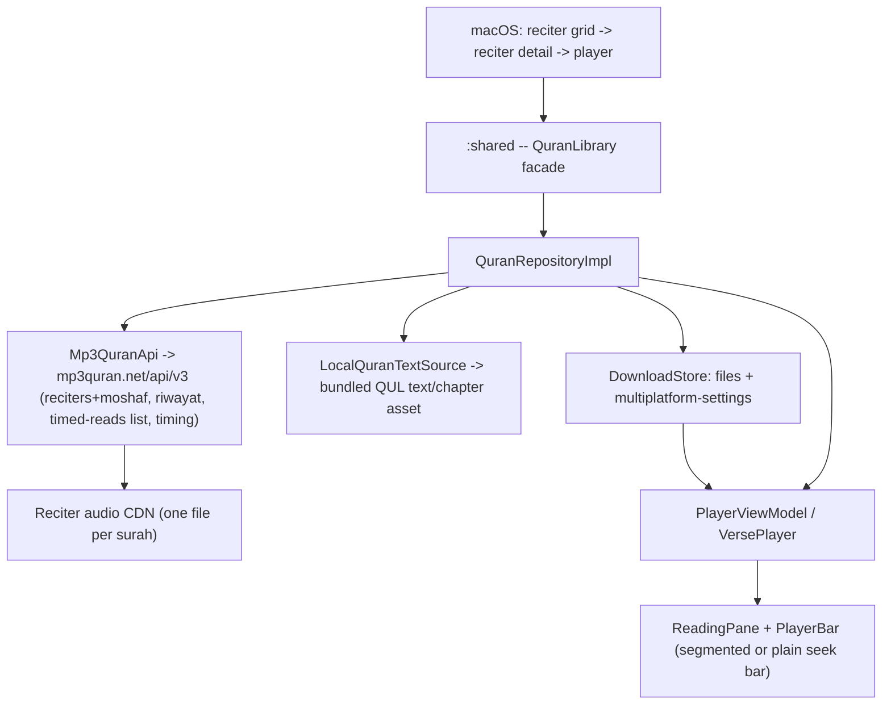

# Requirements

### Overview & Goals

Keep Tilawa's two proven macOS screens working in spirit — a reciter grid, then a text+player view — while reworking the data layer and inserting one new screen between them. Version 1 drops **gapped** (per-ayah) audio entirely and standardizes on **gapless-only** playback: `mp3quran.net` (fully public, no key, 230+ reciters) becomes the sole audio/timing source, Quran text and chapter metadata are bundled once from QUL (`qul.tarteel.ai`) for fully offline use, and no backend is stood up. Between the reciter grid and the player, a new subscreen lets a listener browse that reciter's available recordings grouped **by riwayah first, then by style** (e.g. Hafs 'an Asim → Murattal / Mu'allim), matching how mp3quran.net's own catalog is organized. Selecting an edition opens the familiar player; when that specific edition has no verse-timing data, the reading pane simply shows no highlight and the seek bar is a plain continuous scrubber instead of the segmented, per-verse one. Downloads let a listener cache an edition's surah for offline playback. A future phase (explicitly out of scope here) may add a small backend to bring in Quran Foundation's richer, officially-maintained timing data — this plan documents that path but does not build it.

### Scope

**In scope**
- `:shared` data layer: a new `mp3quran.net` client (reciters, riwayat, moshaf audio, timing), a bundled QUL-derived Quran-text/chapter-metadata asset, a gapless-only domain model, a curated "featured reciters" list, and file-based download support.
- macOS app (`macosApp`): a new reciter-detail subscreen (riwayah → style grouping) inserted between the existing reciter grid and player screen; the player reworked for single-track gapless playback with a graceful no-timing fallback (no highlight, plain seek bar).
- GitHub Projects: populate the "Tilawa Project" board with this plan's stages, plus roadmap cards noting the other four shells will get a refined version of this macOS flow later.

**Out of scope (this iteration)**
- Gapped (per-ayah file) audio in any form — today's `api.quran.com` gapped source is retired outright, not kept as an interim fallback.
- Standing up a backend/token-broker and adopting `api-docs.quran.foundation`'s authenticated Content API — documented in Research Findings as an explicit future phase ("v2"), not built now.
- Building the reciter-grid/detail/player UI for Android, iOS, Windows, or Linux — tracked as roadmap cards only; when built, they're expected to reuse a refined version of the macOS flow designed here.
- Resolving `:shared`'s open local-database decision (SQLDelight vs. Room, see `.agents/skills/kmp-core`) — downloads use plain files + `multiplatform-settings` instead.

### User Stories
- As a listener, I open the app and see a grid of reciters (people), sourced from mp3quran.net.
- As a listener, I tap a reciter and see a subscreen listing their available riwayat (e.g. Hafs 'an Asim, Warsh 'an Nafi'); opening a riwayah shows the styles recorded in it (Murattal, Mujawwad, Mu'allim) — most reciters show just one riwayah with one or two styles.
- As a listener, I pick a specific riwayah + style and the familiar sidebar + mushaf + player bar opens, playing that edition's single continuous per-surah audio file.
- As a listener, when my chosen edition has verse timing, I see the current verse highlighted and a segmented seek bar with verse ticks; when it doesn't, I still get the full reading/listening experience, just with a plain continuous seek bar and no highlight.
- As a listener, I can download a chosen edition's surah and keep listening with no network connection.
- As a maintainer, I can see this plan's stages, plus a roadmap for the remaining four shells and the future backend/Quran Foundation phase, in the repository's GitHub Projects board.

### Functional Requirements
- The home grid shows one card per reciter (name, Arabic name), sourced from mp3quran.net; well-known reciters from the curated list surface first.
- Selecting a reciter opens a new subscreen listing that reciter's editions grouped by riwayah first, then by style within a riwayah; a curated default edition is pre-highlighted for well-known reciters.
- Selecting a riwayah + style opens the existing sidebar + reading-pane + player-bar layout (`PlayerScreen`), now always playing a single continuous per-surah audio file — no gapped path exists.
- The reading pane highlights the current verse and the seek bar renders per-verse tick marks only when the chosen edition's `hasTiming` is true; when it's false, the reading pane shows no highlight at all and the seek bar is a plain continuous scrubber with no ticks or verse numbers.
- A curated list (seeded by this plan's research, ~10 well-known reciters) maps each reciter to a default/preferred edition; the rest of the 230+-reciter catalog stays fully browsable, just unmarked as "featured."
- A downloaded (edition, surah) pair plays back with no network reachable; per-chapter download state (not downloaded / downloading / downloaded) is visible in the UI.

### Non-Functional Requirements
- No OAuth client secret may ship inside any native app binary — this is why v1 stays on mp3quran.net rather than calling `api-docs.quran.foundation` directly (its Client Credentials flow requires a server-held secret).
- `mp3quran.net` has no formal SLA — calls need timeouts and to fail gracefully without crashing the reciter grid, the detail subscreen, or the player.
- The bundled text asset must work fully offline (no network call needed to read Quran text or chapter metadata).
- Riwayah/style grouping must degrade gracefully (a single "Unspecified" bucket) rather than crash when a moshaf's name doesn't match a known pattern.

# Research Findings

### Data Sources Investigated

This table reflects the full landscape researched across this plan's revisions. **Version 1 (this plan) uses only the `mp3quran.net` row** for reciters, audio, and timing, plus QUL for a one-time bundled text asset — the other rows are kept here as the record of what was considered, and as the documented path for a possible v2.

 Source | Quran text | Chapter metadata | Gapped (per-ayah) audio | Gapless (per-surah) audio | Timing / word segments | Auth | Reciter breadth |
---|---|---|---|---|---|---|---|
 `api.quran.com/api/v4` (today's source, unauthenticated) | ✅ Uthmani | ✅ | ✅ `/recitations/{id}/by_chapter/{n}` | limited | ✅ on chapter recitations | none today, but Quran Foundation's own migration guide confirms this legacy host is being sunset | dozens |
 `api-docs.quran.foundation` (its successor) | ✅ same data, versioned `content_apis_versioned/4.0.0` | ✅ | ✅ `/resources/recitations` (separate ID space) | ✅ `/resources/chapter_reciters` (separate ID space) | ✅ rich — `timestamp_from/to` + per-word `segments` in ms | **OAuth2 Client Credentials** — its own quickstart states a `client_secret` "must be kept on the server only"; "Frontend or mobile app clients cannot use this... flow because they do not have a client secret" | dozens |
 `mp3quran.net/api/v3` | ❌ none | names only (via `suwar`) | ❌ none (no per-ayah files at all) | ✅ `moshaf` entries: `{id, name, server, surah_total, moshaf_type, surah_list}` per riwayah/style — plus a separate `/api/v3/riwayat` endpoint listing canonical riwayah id/name pairs | ✅ but only for a **subset** of reciters, via a separate "Timing API" (`surah`+`read` → per-ayah `start_time`/`end_time` ms + mushaf polygon coordinates), with a dedicated "list of reads that has timing" endpoint to identify that subset | none — fully public JSON, no key | **230+ reciters**, largest catalog, many riwayat (Hafs, Warsh, Qalun, Duri, ...) |
 QUL (`qul.tarteel.ai`) | ✅ Uthmani + other scripts, community-vetted | via mushaf-layout downloads | ✅ documented "Ayah-by-Ayah (Gapped)" JSON dataset | ✅ documented "Surah-by-Surah (Gapless)" JSON dataset | ✅ both, explicit per-word ms `segments` | none, but **not a live API** — Tarteel's own help center: "we currently do not offer a public API... QUL... resources can be downloaded" | ~100+ recitation sets, curated dumps only |

### Recommendation: mp3quran.net-first for v1, phased path to Quran Foundation for v2

You confirmed the direction directly: start with mp3quran.net alone (no backend), and treat Quran Foundation as a possible v2 once a backend exists. Since mp3quran.net's `moshaf` entries don't expose an explicit riwayah id, and the reciter subscreen groups by riwayah first, `QuranRepositoryImpl` also fetches `/api/v3/riwayat` once and matches it against each moshaf's name (details in Key Decisions and Technical Design).

- **Audio bytes + timing, single vendor**: every `RecitationEdition` in v1 is sourced entirely from `mp3quran.net` — its `moshaf` catalog for audio (230+ reciters, every major riwayah) and its own Timing API + "list of reads that has timing" endpoint for verse-level ms offsets, wherever that specific edition is in the timed subset. There is no cross-vendor timing merge in v1 — this removes the desync risk a QUL/mp3quran.net blend would carry, at the cost of leaving some editions permanently without timing until mp3quran.net adds it or v2 ships.
- **Text & chapter metadata**: bundled once from QUL as a static asset (114 chapters / 6,236 verses is a few MB) — works fully offline, and sidesteps both `mp3quran.net`'s lack of Quran text and Quran Foundation's auth wall.
- **Gapped audio**: dropped entirely for this version (see "Why Gapless-Only" below) — `api.quran.com`, today's only gapped source, is retired outright rather than kept as an interim fallback.
- **v2, later**: if mp3quran.net's timing coverage proves too thin, a small backend (token-broker holding an OAuth `client_secret`) can be added to call `api-docs.quran.foundation`'s Audio API directly, which offers richer, officially-maintained per-word timing on its own (smaller) reciter catalog. This plan documents the option but doesn't build it.

**Backend-less (v1) vs. backend-broker (possible v2), compared directly:**

 Backend-less, mp3quran.net-only (this plan) | Token-broker + Quran Foundation (possible v2) |
---|---|---|
 New infra to run | None | One serverless proxy holding the OAuth secret |
 Reciter breadth | 230+ (mp3quran.net) | Dozens (Quran Foundation's curated reciter list) |
 Timing coverage | Per-edition, partial, mp3quran.net-only, with graceful degrade | Richer, official, per-word, wherever Quran Foundation has the recording |
 Ops burden | None beyond the app itself | A hosted service to build, deploy, monitor, and pay for |
 Fit with current architecture | Matches `.ai/arch/APP_STACKS_PLAN.md` ("no shared UI runtime", client-only) exactly | Introduces a component type the project has never had |

**Verdict**: ship the backend-less, mp3quran.net-only v1 now; keep the token-broker + Quran Foundation path documented as the natural v2, revisited only once mp3quran.net's timing coverage or reciter set becomes a real limitation.

### Why Gapless-Only

You asked to drop gapped mode for this version. Grounding that in the research: QUL's docs define both shapes explicitly ("Ayah-by-Ayah / Gapped": one file per verse; "Surah-by-Surah / Gapless": one file per surah + a companion timing map), and today's Tilawa (`VersePlayer` chaining one file per verse via `PlayerViewModel.advance()`) is a gapped implementation. Standardizing on gapless-only for v1 is a clean fit because:
- `mp3quran.net` — the chosen v1 source — is **gapless-only by construction**: every `moshaf` entry is one `server` URL plus a `surah_list`, never per-ayah files. There is nothing to reconcile.
- Dropping the gapped/gapless split removes an entire axis of complexity from the domain model (`PlaybackTrack` becomes one concrete shape, not a sealed `Gapped`/`Gapless` pair) and from the player (`VersePlayer`/`PlayerViewModel` lose the per-ayah chaining path entirely).
- If a future phase needs gapped audio again (e.g. for a reciter only available that way), QUL's "Ayah-by-Ayah (Gapped)" dataset and Quran Foundation's separate `recitations` catalog remain documented, available options — just not built in this plan.

### Timing for Gapless Audio: mp3quran.net's Mechanism

Re-verified specifically for this project: gapless audio never carries timing inside the audio bytes themselves (no gaps to mark verse boundaries) — every source attaches it as a separate dataset or call, keyed by ayah. For v1, Tilawa uses **only** mp3quran.net's own mechanism:

- **`mp3quran.net` Timing API** (`mp3quran.net/ar/api`) — ayah-level. `GET` with `surah` + `read` (a moshaf/edition id) returns `[{"ayah": 1, "start_time": 5587, "end_time": 12658, "polygon": "...", "page": ...}, ...]` in ms, aligned against that edition's one-file-per-surah audio.
- **mp3quran.net's "list of reads that has timing"** endpoint — the source of truth for `RecitationEdition.hasTiming`: only editions in this list get a timing call at all; everyone else is `hasTiming = false` from the start, no probing required.
- Granularity stops at the ayah level — no per-word segments from this source.

Kept for context, **not used in v1**: QUL's "With segments" datasets give per-**word** timing (`{"1:1": {"segments": [[word_index, start_ms, end_ms], ...], ...}}`) but only for ~57-58 of ~131 recitation resources, as a static downloadable dataset; and `api-docs.quran.foundation`'s Audio API gives live per-word `segments` on request, but needs the server-held OAuth secret this v1 doesn't have. Both remain documented candidates for a v2 that wants richer-than-ayah-level timing or broader coverage — see "Recommendation" above.

### Most Popular Reciters & Their Most Popular Version

None of the sources expose a "popularity" field — this is inherently editorial, so the following is a curated starting list (open to maintainer revision), grounded in reciter guides and app-store rankings researched for this plan. Every entry is Hafs 'an Asim, which fits the new riwayah-first grouping directly:

 Reciter | Riwayah | Default style | Note |
---|---|---|---|
 Mishary Rashid Alafasy | Hafs 'an Asim | Murattal | Most-streamed contemporary reciter |
 Abdur-Rahman As-Sudais | Hafs 'an Asim | Murattal | Imam of Masjid al-Haram |
 Saud Ash-Shuraym | Hafs 'an Asim | Murattal | Long-time co-Imam of Masjid al-Haram |
 Mahmoud Khalil Al-Husary | Hafs 'an Asim | Murattal (default); Mu'allim (teaching) as secondary | Mu'allim edition is the tajweed-teaching standard |
 Mohamed Siddiq Al-Minshawi | Hafs 'an Asim | Murattal (default); Mu'allim as secondary | Balanced tajweed + memorization choice |
 Abdul Basit Abdul Samad | Hafs 'an Asim | Murattal (default); Mujawwad flagged as signature style | First reciter to record both styles complete |
 Saad Al-Ghamdi | Hafs 'an Asim | Murattal | Widely used for memorization |
 Ali Al-Huthaify | Hafs 'an Asim | Murattal | Madinah recitation standard |
 Maher Al Muaiqly | Hafs 'an Asim | Murattal | Imam of Masjid al-Haram |
 Yasser Al-Dosari | Hafs 'an Asim | Murattal | Popular contemporary Haramain reciter |

This plan does not fabricate specific mp3quran.net numeric reciter/moshaf ids for this table — `featured_reciters.json` (delivery stage 3) resolves them by matching reciter name against the live `/api/v3/reciters` response at implementation time, so the ids are verified rather than guessed.

### GitHub Projects Publication Constraint

The repository is `AhmedvHashem/Quran`. The environment's `gh` CLI is authenticated but its token only carries `gist`, `read:org`, `repo` — **not** `project`/`read:project`, so no existing "Tilawa Project" board could be listed or created from here. Running `gh auth refresh -s project` (an interactive device-code login) is a prerequisite for the delivery stage that publishes this plan to GitHub Projects.

# Technical Design

### Current Implementation

- **`:shared` (`commonMain`)**: `QuranLibrary` (`shared/.../QuranLibrary.kt`) is a narrow façade — `reciters()`, `chapters()`, `verses(chapterId, reciterId)` — backed by `GetReciters`/`GetChapters`/`GetSurah` (`domain/usecase/QuranUseCases.kt`) → `QuranRepositoryImpl` (`data/QuranRepositoryImpl.kt`) → `QuranApi` (`data/remote/QuranApi.kt`), which calls `https://api.quran.com/api/v4` for everything: reciters (`/resources/recitations`), chapters (`/chapters`), verse text (`/verses/by_chapter/{id}`), and per-ayah audio (`/recitations/{reciterId}/by_chapter/{chapterId}`, files on `verses.quran.com`). Today's `Reciter(id, name, arabicName, style)` (`domain/model/QuranModels.kt`) already collapses "reciter" and "style" into one flat row — there's no grouping concept at all — and `Verse(number, text, audioUrl)` carries a per-verse `audioUrl` that only makes sense for gapped audio. This entire client, and both of these shapes, are retired by this plan (see Key Decisions).
- **macOS (`macosApp/Sources/TilawaMac`)**: `AppRouter` (`App/AppRouter.swift`) has exactly two routes today (`.reciters`, `.player(Reciter)`) — selecting a reciter card in `ReciterGridView` (via `RecitersViewModel`) jumps straight to `PlayerScreen`. `PlayerViewModel.cue(index)` loads `verses[index].audioUrl` (one file per ayah) into the single `VersePlayer` it owns, and `advance()` (wired to `VersePlayer.onFinish`) chains to the next verse — this **is** today's gapped model, hardcoded in `PlayerViewModel.swift`. `ReadingPane` highlights by array index (`viewModel.verseIndex`), which only works because gapped mode sets that index directly on each per-ayah load.
- **`VersePlayer`** (`Playback/VersePlayer.swift`) is an `AVPlayer` wrapper — `load/play/pause/toggle/restart/clear`, an `onFinish` callback, a 0.2s periodic time observer. `restart()` only seeks to zero; there is **no arbitrary `seek(to:)` today**.
- **`PlayerBar`**'s `VerseSeekBar` (`PlayerBar.swift`) draws one tick per verse at **equal width** — its own comment already flags this as an approximation because no real per-verse duration data exists today. `ChapterSidebar`'s back button calls `router.backToReciters()` directly — there's no intermediate screen to return to yet.
- **C ABI** (`shared/src/cApiMain/.../SharedCApi.kt`): only `shared_abi_version`, `shared_greet`, `shared_string_free` — no Quran domain call is exposed to Windows/Linux, confirming those shells have nothing to preserve.
- **Governing doc** `.ai/arch/APP_STACKS_PLAN.md` confirms the narrow-façade rule and lists the local-database choice as an explicit, still-open gate — this plan leaves that gate closed, using file + `multiplatform-settings` caching for downloads instead.

### Key Decisions

1. **mp3quran.net-only for v1, Quran Foundation deferred to v2** — every `RecitationEdition`'s reciter data, audio, and timing come from `mp3quran.net`; `api.quran.com`/`QuranApi.kt` is deleted outright (not kept as a fallback); `api-docs.quran.foundation` + a token-broker backend is documented as the natural v2 upgrade path, not built now.
2. **Single, non-sealed `PlaybackTrack`** — since gapped mode is dropped, `PlaybackTrack` is one concrete shape (`trackUrl` + `verses` + optional `timing`), not a `Gapped`/`Gapless` sealed hierarchy; `VersePlayer`/`PlayerViewModel` lose the per-ayah chaining path (`cue`/`advance`) entirely and always load exactly one file per surah.
3. **Riwayah/style grouping derived client-side** — `mp3quran.net`'s `moshaf` entries carry a combined name (e.g. "Rewayat Hafs A'n Assem - Murattal") with no explicit riwayah id; `QuranRepositoryImpl` resolves `riwayah` by matching that name against the fetched `/api/v3/riwayat` list, takes the remainder as `style`, and falls back to a single "Unspecified" riwayah bucket when nothing matches — chosen per your answer to group by riwayah first, then style.
4. **`hasTiming` from a single source of truth** — set strictly from mp3quran.net's own "list of reads that has timing" endpoint; no cross-vendor merge in v1 (simpler and desync-proof, at the cost of some editions never showing timing until v2).
5. **Offline downloads** — plain files in a per-platform cache directory plus a small manifest in `multiplatform-settings`, keyed by `(editionId, chapterId)` — one file per key now, since gapless means exactly one download per surah instead of N per-ayah files. No SQLDelight/Room introduced.
6. **Curation delivery** — a static `featured_reciters.json` bundled into `:shared` resources, mapping a curated reciter to a default/preferred edition id (resolved by name-matching at implementation time), revised via PR since there's no backend.

### Proposed Changes

- New `Mp3QuranApi` (`data/remote/`), a Ktor client modeled on today's `QuranApi.kt`: `reciters()` (parses nested `moshaf[]` per reciter), `riwayat()` (canonical riwayah id/name list, fetched once), `timedReadIds()` (the "has timing" list), and `timing(surahId, editionId)` (the Timing API, called only for editions in the timed set).
- New `LocalQuranTextSource` (`data/local/`) loading a bundled `quran_text.json` (Uthmani text + chapter metadata, derived once from QUL) — fully replaces the live `/chapters` and `/verses/by_chapter` calls.
- Delete `QuranApi.kt` and its DTOs; `QuranRepository`/`QuranRepositoryImpl` now compose exactly the two sources above (plus the new `DownloadStore`), and add the riwayah/style derivation described in Key Decisions.
- Rework `GetSurah` to return one `PlaybackTrack` (track URL + verses + optional timing); add `GetRecitationEditions` for the new subscreen.
- macOS: add `AppRouter.Route.reciterDetail(Reciter)` between `.reciters` and `.player`, and change `.player`'s payload to carry the chosen `Reciter` + `RecitationEdition`; add `ReciterDetailView`/`ReciterDetailViewModel` grouping editions by riwayah then style; add `VersePlayer.seek(to:)`; remove `PlayerViewModel`'s `cue`/`advance` chaining in favor of one track load plus a timing-driven `verseIndex` (or none); split `PlayerBar`'s seek row into the existing `VerseSeekBar` (now driven by real timing ticks) for timed editions and a new plain continuous bar otherwise; point `ChapterSidebar`'s back button at the reciter-detail subscreen instead of the grid; add a `DownloadStore` platform-service interface injected into `QuranLibrary`, per `kmp-core`'s constructor-injection rule.

### Data Models / Contracts

```kotlin
@Serializable
data class Reciter(
    val id: Int,          // mp3quran.net reciter id
    val name: String,
    val arabicName: String,
)

@Serializable
data class Riwayah(
    val id: Int?,         // null only for the "Unspecified" fallback bucket
    val name: String,     // e.g. "Hafs A'n Assem", from mp3quran.net's /api/v3/riwayat
)

@Serializable
data class RecitationEdition(
    val id: Int,                    // mp3quran.net moshaf id
    val reciterId: Int,
    val riwayah: Riwayah,
    val style: String,              // "Murattal" | "Mujawwad" | "Mu'allim" | ...
    val serverBaseUrl: String,      // append zero-padded surah number + ".mp3"
    val availableSurahs: Set<Int>,  // parsed from moshaf.surah_list
    val hasTiming: Boolean,         // true only if on mp3quran.net's "has timing" list
    val isFeatured: Boolean,
)

@Serializable
data class Chapter(
    val id: Int,
    val name: String,
    val translatedName: String,
    val arabicName: String,
    val versesCount: Int,
    val revelationPlace: RevelationPlace,
)

@Serializable
data class Verse(val number: Int, val text: String) // no audioUrl -- one file per surah now

data class VerseTiming(val verseNumber: Int, val startMs: Long, val endMs: Long)

/** One playable surah: exactly one audio file, plus timing only when the edition has it. */
data class PlaybackTrack(
    val trackUrl: String,
    val verses: List<Verse>,
    val timing: List<VerseTiming>?, // null when the edition's hasTiming is false
)
```

```kotlin
interface QuranRepository {
    suspend fun reciters(): List<Reciter>
    suspend fun editions(reciterId: Int): List<RecitationEdition>
    suspend fun chapters(): List<Chapter>
    suspend fun verses(chapterId: Int): List<Verse>
    suspend fun playbackTrack(chapterId: Int, editionId: Int): PlaybackTrack
}

class GetRecitationEditions(private val repository: QuranRepository) {
    suspend operator fun invoke(reciterId: Int): List<RecitationEdition> = repository.editions(reciterId)
}

class GetSurah(private val repository: QuranRepository) {
    suspend operator fun invoke(chapterId: Int, editionId: Int): PlaybackTrack =
        repository.playbackTrack(chapterId, editionId)
}
```

### Components

 Component | Change |
---|---|
 `QuranApi` (api.quran.com) | **Removed** — fully replaced by `Mp3QuranApi` + `LocalQuranTextSource` |
 `Mp3QuranApi` *(new)* | Reciters + moshaf, riwayat list, timed-reads list, per-edition timing, gapless audio URLs |
 `LocalQuranTextSource` *(new)* | Bundled Uthmani text + chapter metadata, zero network |
 `QuranRepositoryImpl` | Composes both sources; derives riwayah/style; resolves `hasTiming` |
 `GetRecitationEditions` *(new)* | Reciter's editions for the new detail subscreen |
 `GetSurah` | Returns a single `PlaybackTrack` — no more Gapped/Gapless split |
 `VersePlayer` (macOS) | Adds `seek(to:)`; always single-track now |
 `PlayerViewModel` (macOS) | Drops `cue`/`advance` chaining; loads one track; timing-driven `verseIndex` or none |
 `AppRouter` (macOS) | Gains `.reciterDetail(Reciter)`; `.player` now carries `Reciter` + `RecitationEdition` |
 `ReciterGridView`/`RecitersViewModel` (macOS) | One card per reciter (was per style); featured ordering |
 `ReciterDetailView`/`ReciterDetailViewModel` *(new, macOS)* | Riwayah → style grouping; opens player on leaf selection |
 `PlayerBar`/`VerseSeekBar` (macOS) | Segmented (real timing ticks) only when `hasTiming`; new plain mode otherwise |
 `ReadingPane` (macOS) | Highlights only when `hasTiming`; otherwise static, unhighlighted mushaf |
 `ChapterSidebar` (macOS) | Back button returns to reciter detail, not the grid |
 `DownloadStore` *(new)* | Keyed by `(editionId, chapterId)` — one file per surah |

### File Structure

```
shared/src/commonMain/
├── kotlin/.../data/remote/Mp3QuranApi.kt         (new — replaces QuranApi.kt)
├── kotlin/.../data/local/LocalQuranTextSource.kt (new)
├── kotlin/.../data/DownloadStore.kt              (new interface)
├── kotlin/.../data/QuranRepositoryImpl.kt        (rewritten: composes the two new sources + DownloadStore)
├── kotlin/.../domain/QuranRepository.kt          (port extended: editions(), playbackTrack())
├── kotlin/.../domain/model/QuranModels.kt        (Reciter simplified; + Riwayah, RecitationEdition, VerseTiming, PlaybackTrack; Verse drops audioUrl)
├── kotlin/.../domain/usecase/QuranUseCases.kt    (+ GetRecitationEditions; GetSurah returns PlaybackTrack)
└── resources/quran_text.json, featured_reciters.json (new bundled assets)

shared/src/commonMain/kotlin/.../data/remote/QuranApi.kt   (deleted — api.quran.com retired)

macosApp/Sources/TilawaMac/
├── App/AppRouter.swift                       (3 routes: reciters / reciterDetail / player)
├── Playback/VersePlayer.swift                (+ seek(to:))
├── Features/Player/PlayerViewModel.swift     (drop cue/advance; single-track + timing-driven verseIndex)
├── Features/Player/PlayerBar.swift           (VerseSeekBar for hasTiming, new plain seek bar otherwise)
├── Features/Player/ReadingPane.swift         (guard highlight on hasTiming)
├── Features/Player/ChapterSidebar.swift      (back -> reciterDetail, not reciters)
├── Features/Reciters/ReciterGridView.swift   (card per reciter; copy update)
├── Features/Reciters/RecitersViewModel.swift (loads mp3quran reciters)
└── Features/ReciterDetail/ReciterDetailView.swift + ReciterDetailViewModel.swift (new)
```

### Architecture Diagram

Data flow:



Navigation flow (new subscreen inserted between grid and player):


### Risks

- **GitHub scope**: current `gh` token lacks `project`/`read:project` — must run `gh auth refresh -s project` before the publishing stage can execute.
- **Riwayah/style derivation is heuristic**: mp3quran.net's `moshaf.name` string (e.g. "Rewayat Hafs A'n Assem - Murattal") is the only signal available — mitigated by matching it against the canonical `/api/v3/riwayat` list and falling back to a single "Unspecified" bucket rather than misgrouping or crashing.
- **Timing coverage is partial and visible**: only editions on mp3quran.net's "has timing" list get highlighting and a segmented seek bar — this is now a hard, user-visible product constraint rather than a hidden cross-vendor merge, and is exactly what triggers the plain-seek-bar/no-highlight fallback UI.
- **No SLA on `mp3quran.net`**: a community-run service — mitigated with request timeouts and graceful UI fallback (never block the reciter grid, detail subscreen, or player on one failed call).
- **QUL per-resource licensing**: QUL confirms commercial use is generally fine but says to review each resource's license before bundling it — check the specific text dataset picked before shipping.
- **Curated edition ids need real verification**: the ~10-reciter curated list's specific mp3quran.net moshaf ids must be resolved by matching reciter names against the live API during implementation, not fabricated in this plan.

# Testing

### Validation Approach

Extend the existing `commonTest` pattern (`shared/src/commonTest/.../QuranRepositoryImplTest.kt`), which already uses Ktor's `MockEngine` plus `kotlin.test` to assert DTO-to-domain mapping without a network call. Every new remote client, the riwayah/style derivation, and the reciter-detail grouping logic get the same treatment before any platform consumes them, per the `kmp-core` skill's testing rule.

### Key Scenarios
- `Mp3QuranApi` parses `reciters()` and nested `moshaf` entries into `RecitationEdition`s with the correctly derived `riwayah` and `style`.
- Riwayah derivation matches a moshaf name against the fetched `/api/v3/riwayat` list, and falls back to the "Unspecified" bucket when no match exists.
- `hasTiming` is set strictly from membership in mp3quran.net's "list of reads that has timing" endpoint — no cross-vendor merge.
- `GetSurah`/`playbackTrack` returns a `PlaybackTrack` with `timing = null` for a non-timed edition and a populated list for a timed one.
- A timing lookup correctly maps an elapsed-time value to the right `VerseTiming` entry (the function `PlayerViewModel` calls every 0.2s tick).
- `LocalQuranTextSource` loads text/chapters with no `HttpClient` involved.
- The reciter-detail grouping function groups a reciter's editions by riwayah then style correctly, including the common case of a single riwayah with one or two styles.

### Edge Cases
- An edition with `hasTiming = false` still produces a fully playable `PlaybackTrack` with `timing = null`; `ReadingPane` shows no highlight and `PlayerBar` shows the plain seek bar — must not crash.
- A moshaf's `surah_list` doesn't include the requested chapter (some reciters only recorded part of the Quran) — surfaced as a clear "not available in this edition" state rather than an empty player.
- Seeking past the end of a track, and seeking while the track is still loading.
- A downloaded file exists but is incomplete/corrupted — falls back to streaming rather than failing playback outright.
- A featured/curated reciter is temporarily missing from the live mp3quran.net catalog — the grid omits the "featured" tag rather than erroring the whole list.
- A reciter with only one riwayah and one style — the detail subscreen still shows that single group cleanly, without an awkward empty second level.

# Delivery Steps

### ✓ Step 1: Replace the data layer with mp3quran.net and a bundled QUL text asset
`:shared` sources reciters, editions, gapless audio, and timing entirely from mp3quran.net, and Quran text/chapter metadata from a bundled offline asset, with `api.quran.com`/`QuranApi.kt` fully retired.
- Add `Mp3QuranApi` (`data/remote/Mp3QuranApi.kt`) calling `mp3quran.net/api/v3/reciters` (nested `moshaf[]`), `/api/v3/riwayat`, the "list of reads that has timing" endpoint, and the Timing API (`surah` + `read`).
- Derive a bundled Uthmani-text + chapter-metadata JSON asset from QUL and load it via a new `LocalQuranTextSource`, with zero network calls.
- Delete `QuranApi.kt` and its api.quran.com DTOs entirely; update `QuranRepository`/`QuranRepositoryImpl` to depend only on the two new sources.
- Add MockEngine-based `commonTest` coverage for `Mp3QuranApi` and `LocalQuranTextSource`, mirroring `QuranRepositoryImplTest.kt`.

### ✓ Step 2: Model riwayah/style grouping and a single gapless PlaybackTrack
The domain layer represents every recording as one gapless `RecitationEdition` grouped by riwayah and style, and `GetSurah` returns one `PlaybackTrack` with optional timing.
- Rework `domain/model/QuranModels.kt`: simplify `Reciter` to id/name/arabicName, add `Riwayah`, `RecitationEdition`, `VerseTiming`, and a single (non-sealed) `PlaybackTrack`; drop `audioUrl` from `Verse` since audio is per-surah, not per-verse.
- Implement riwayah/style derivation in `QuranRepositoryImpl`: match each moshaf's `name` against the fetched `/api/v3/riwayat` list, falling back to an "Unspecified" bucket when unmatched.
- Resolve `hasTiming` strictly from mp3quran.net's own "list of reads that has timing" endpoint.
- Add `GetRecitationEditions` use case and rework `GetSurah` to return `PlaybackTrack`; add contract tests for the derivation and the no-timing path.

### ✓ Step 3: Add the reciter-detail subscreen with riwayah-then-style navigation
Choosing a reciter opens a new subscreen listing their editions grouped by riwayah first and style second, with a curated default edition pre-highlighted, before the player opens.
- Add `AppRouter.Route.reciterDetail(Reciter)` between `.reciters` and `.player`, and change `.player`'s payload to carry the chosen `Reciter` + `RecitationEdition`.
- Add `ReciterDetailView`/`ReciterDetailViewModel` (new, under `Features/ReciterDetail/`) that loads `GetRecitationEditions`, groups by riwayah then style, and opens `.player(reciter, edition)` on selection.
- Add `featured_reciters.json` to `:shared` resources, seeded with the researched shortlist (Alafasy, As-Sudais, Ash-Shuraym, Al-Husary, Al-Minshawi, Abdul Basit, Al-Ghamdi, Al-Huthaify, Al Muaiqly, Al-Dosari), matched to their mp3quran.net reciter/edition ids at implementation time.
- Update `ReciterGridView`/`RecitersViewModel` to show one card per human reciter and update the header copy accordingly.

### ✓ Step 4: Rework VersePlayer and PlayerViewModel for single-track gapless playback
The player always plays one continuous per-surah file, highlighting the current verse and showing a segmented seek bar only when the chosen edition has timing.
- Add `seek(to seconds:)` to `VersePlayer`.
- Remove `PlayerViewModel`'s `cue`/`advance` per-ayah chaining; `open(chapter)` loads the edition's single track once via `library.surah(...)`.
- Derive `verseIndex` each tick from `player.elapsed` against `PlaybackTrack.timing` only when present; otherwise no verse is ever "current".
- Update `PlayerBar`: keep `VerseSeekBar` (now driven by real per-verse timing ticks) when timing exists; add a new plain, continuous seek bar for when it doesn't; make `ReadingPane` skip highlighting entirely in the no-timing case.
- Update `ChapterSidebar`'s back action to return to the reciter-detail subscreen instead of the reciter grid.

### ✓ Step 5: Add per-edition download and offline playback
A listener can download a chosen edition's surah (one file, since gapless) and keep listening with no network reachable.
- Add a `DownloadStore` narrow `commonMain` interface (constructor-injected per `kmp-core`) with per-platform file-system implementations, keyed by `(editionId, chapterId)`.
- Track download state (not downloaded/downloading/downloaded) in `multiplatform-settings`.
- Extend `PlayerBar`/`ChapterSidebar` with a download affordance and state indicator per chapter.
- Make `playbackTrack` resolution prefer a downloaded local file over the network URL when present.

### ✓ Step 6: Publish the plan and roadmap to the Tilawa Project GitHub board
The "Tilawa Project" GitHub Projects board contains this plan's stages plus roadmap cards noting the other four shells will consume a refined version of this macOS flow.
- Create (or reuse) the "Tilawa Project" board on `AhmedvHashem/Quran` and add one card per stage above.
- Add roadmap-only cards for Android, iOS, Windows, and Linux, noting each will be a refined version of the macOS reciter-grid/detail/player flow, plus a separate roadmap card for the future backend/Quran-Foundation phase.
- Flag the current `gh` token's missing `project`/`read:project` scope (`gh auth refresh -s project` required) as a prerequisite so this stage isn't silently blocked.